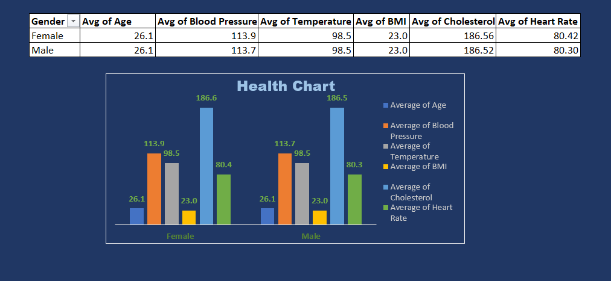
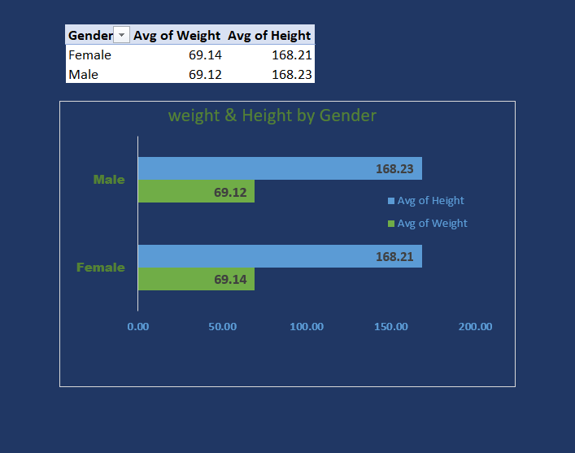
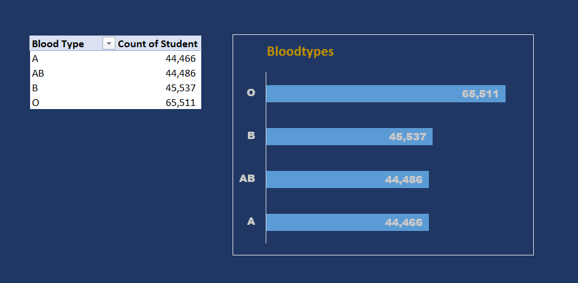
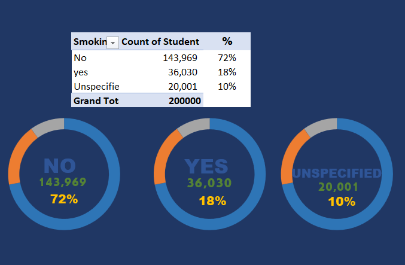
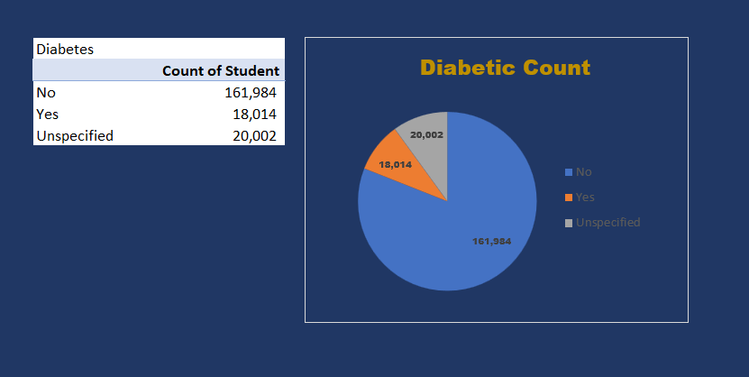
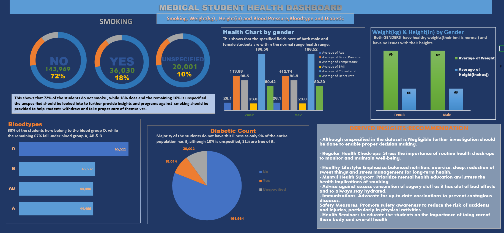

# Medical student Data Analysis

---

## INTRODUCTION

This is an excel project on a Medical students dataset aimed to Analyze and derive insight from the Data to determine how well the students are doing Healthwise to help the School make more concise decisions on their Health Management System and Methods.

_Disclaimer: All datasets and report do not in any way represent any institution, This is just a dummy dataset to showcase my ability to use Excel_

### Data Sources

This is  dummy data gottten from the internet

### Problem Statement

1. Identify Health Trends
2. Highlight Health Challenges 
3. Provide Recommendations
4. Promote Preventive Care

### SKILLS

Data cleaning and Visualization

### Tool

1. Excel : data cleaning and visualization

## Data Preparation

in the initial preparation, i performed the following

- Data creation / loading
- Data inspection and handling missing values
- Data cleaning and formatting
- Pivot tables creation

  ## Analysis

 ### Students History:  
  The school currently has a total of **200,000** students.
  With 55% of them being male while 45% are female.
  
- Students health Category:

 

The table above is showing the average Bmi, age, blood pressure , heartrate, cholesterol level and Temperature of both male and female students and i obervered that all the above are within the normal range health range.

- **AVERAGE HEIGHT AND WEIGHT OF STUDENTS**

This table is showing the average weight and height of both male and female students and its observed that both have healthy weights(their bmi is normal) and have no issues with their heights.

- **BLOODTYPE**

This table is showing the bloodtype of the students.
33% of the students here belong to the blood group **O**.
while the remaining 67% fall under blood group A, AB & B.

- **SMOKING**

This table shows the count of students who are smokers and those who are not.
I observed that 72% of the students do not smoke , while 18% does and the remaining 10% is unspecified.

- **DIABETES**

This table shows the number of students who are diabetic and those who are not. 
Diabetes is an illness and only 9% of the entire student population has it whilw 10% is unspecified, 81% do not have this illness.

### DASHBOARD

## CONCLUSION / RECOMMADATIONS

CONCLUSION :
The overall health of the students is looking good. 😃💃
The illness(diabetes) tho negligible(as its not contagious) would affect the students if not properly taken care of.

# Recommendation

Regular Health Check-ups: Stress the importance of routine health check-ups to monitor and maintain well-being.

Healthy Lifestyle: Emphasize balanced nutrition, exercise, sleep, reduction of sweet things and stress management for long-term health.

Mental Health Support: Prioritize mental health education and resources to help manage academic and personal stress and stress the health implications of smoking 

Immunizations: Advocate for up-to-date vaccinations to prevent contagious diseases.

Safety Measures: Promote safety awareness to reduce the risk of accidents and injuries, particularly in physical activities.

### THANK YOU. 😄

  
